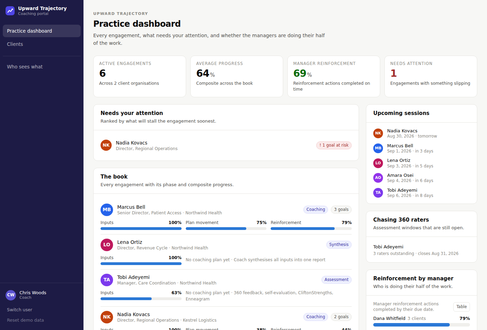
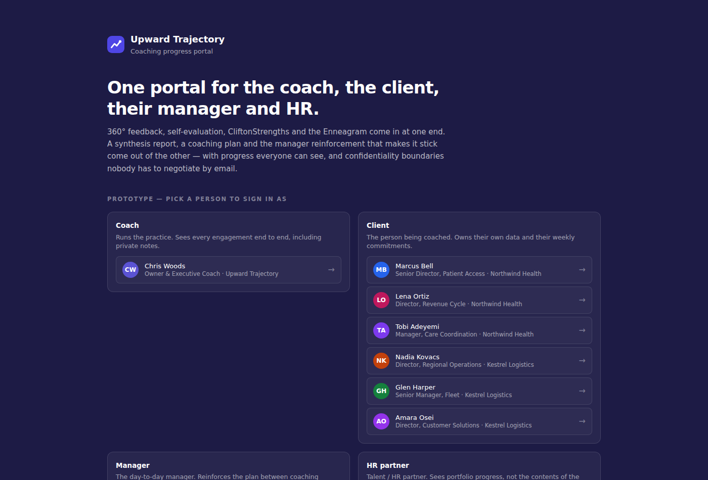
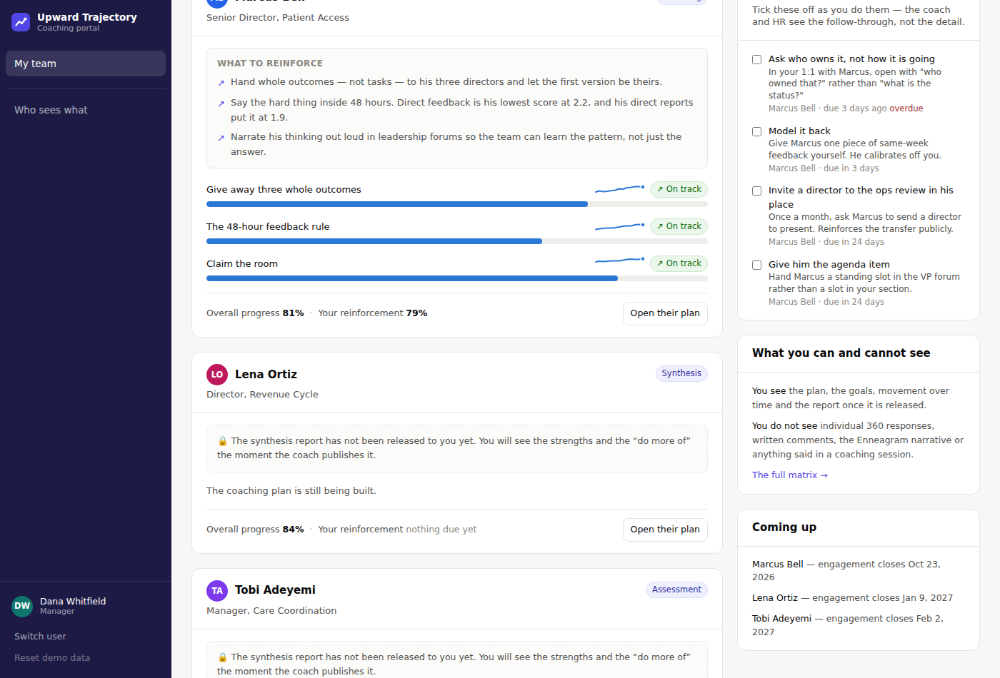
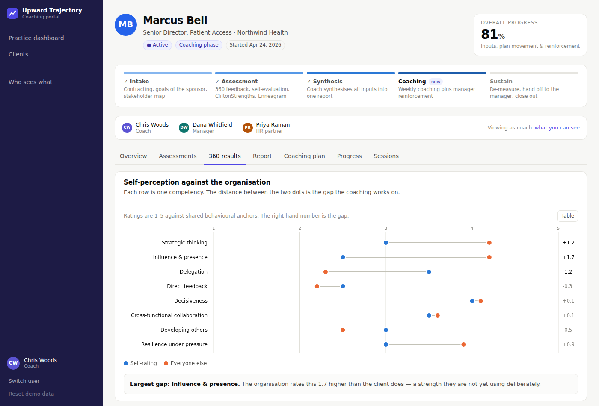
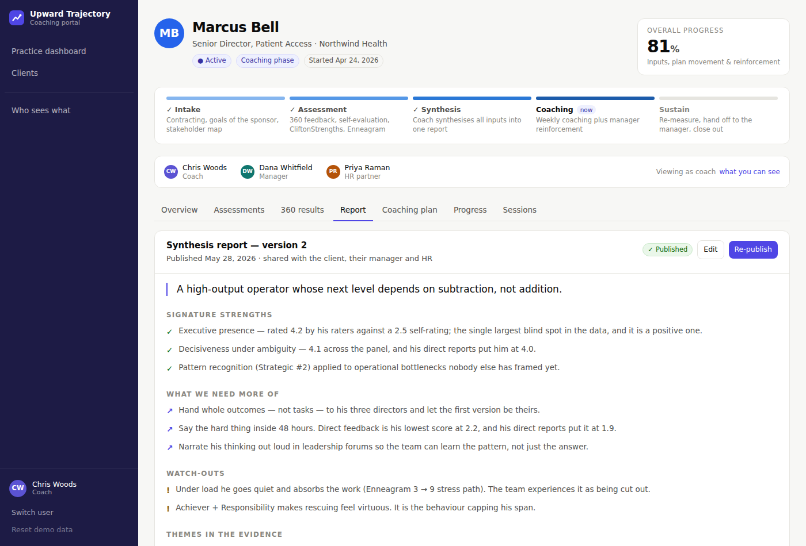
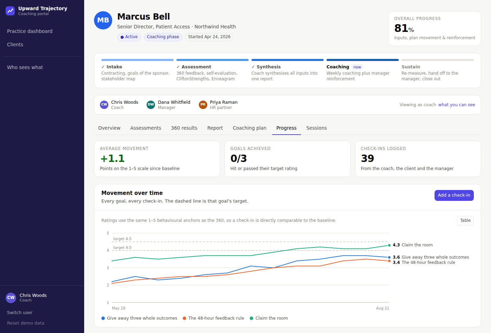
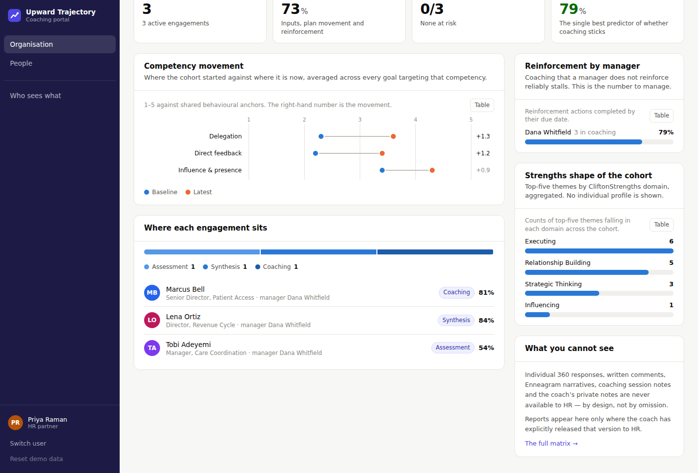
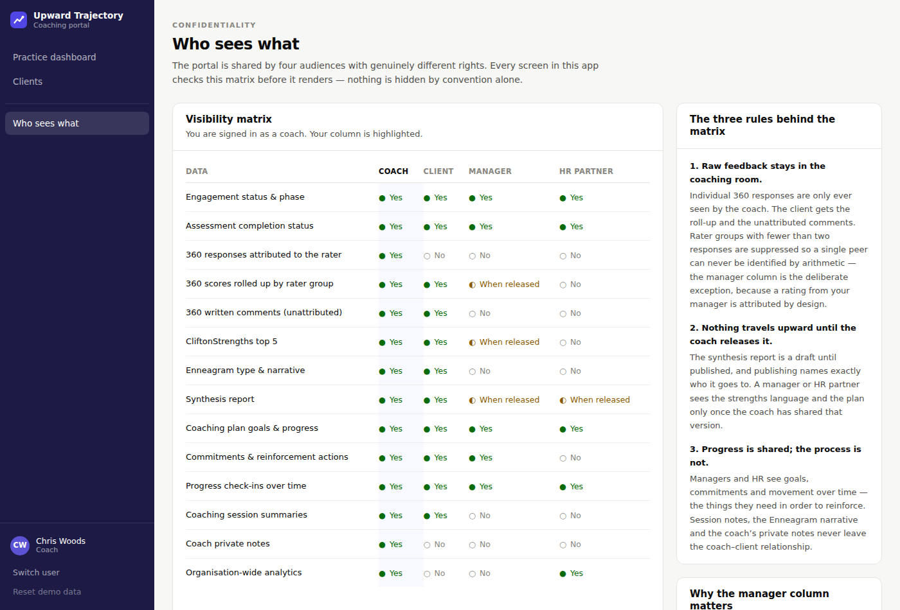

# Upward Trajectory — coaching progress portal

A working prototype of the client portal Chris Woods described for **Upward Trajectory**, his
career coaching and consulting practice:

> "I'd love to have a portal login for my clients where they can see and I can see all the progress
> they're making… it starts with 360-degree feedback from their colleagues and their bosses, it's
> self-evaluations, it's them doing both the CliftonStrengths as well as the Enneagram, for me to
> then synthesise into a report for them. And then have that same portal system be accessible by
> both the clients as well as their managers, as well as HR… with the reinforcement that is then
> required by their day-to-day manager, so it's not just me on the weekly coaching. And being able
> to track that progress on a dashboard by the individual, by their manager, by HR."

Everything in that paragraph is built. Four audiences share one portal, and what each of them can
see is enforced in code rather than by convention.

### ▸ [Open the live prototype](https://nicholas-adams094.github.io/Upward-Trajectory-Prototype-App/)

No backend, no accounts, no setup — pick a person on the sign-in screen and you are in the portal
exactly as they would see it. Everything is clickable, and the demo data lives only in your own
browser, so you cannot break anyone else's copy. **Reset demo data** in the sidebar puts it back.

To run it locally instead:

```bash
npm install
npm run dev      # http://localhost:5173
```



---

## The four roles

| Sign in as | Sees |
|---|---|
| **Chris Woods** — coach | Every engagement end to end. Practice dashboard, the whole book, attributed 360 responses, private session notes, report authoring and publishing. |
| **Marcus Bell** — client | Their own assessments, report, plan, commitments and progress. Never the coach's private notes or who said what in their 360. |
| **Dana Whitfield** — manager | Their direct reports' plans, progress and the reinforcement actions that are theirs to do. Never verbatims, the Enneagram or session notes. |
| **Priya Raman** — HR partner | Portfolio-level progress, competency movement and reinforcement rates. Never the contents of the coaching room. |

Six seeded engagements sit at different points of the lifecycle, so every state in the product is
reachable without clicking anything: **Amara Osei** is at intake, **Tobi Adeyemi** is mid-assessment
with raters outstanding, **Lena Ortiz** has a report in draft, **Marcus Bell** and **Nadia Kovacs**
are in active coaching, and **Glen Harper** has finished and moved to sustain.

| | |
|---|---|
|  |  |
| **Sign in as any of the four roles** | **The manager's reinforcement dashboard** |
|  |  |
| **Self-perception against the organisation** | **The synthesis report** |
|  |  |
| **Every check-in from all three parties** | **HR's portfolio view** |

## The lifecycle it models

**Intake → Assessment → Synthesis → Coaching → Sustain**

1. **Assessment.** A self-evaluation and a 360 panel (manager, peers, direct reports, stakeholders)
   both rate the same eight leadership competencies against the same 1–5 behavioural anchors, so the
   numbers are directly comparable. CliftonStrengths top five and the Enneagram result are recorded
   alongside them.
2. **Synthesis.** The coach writes one report — headline, signature strengths, what we need more of,
   watch-outs and evidence-backed themes — then publishes it and names exactly who it goes to.
3. **Coaching plan.** The report's "what we need more of" becomes goals, each with a baseline taken
   from the 360, a target, behavioural measures, weekly commitments for the client **and
   reinforcement actions for the manager**.
4. **Progress.** The coach, the client and the manager all log check-ins against the same 1–5 scale.
   Every rating plots on one chart, so the disagreement between them is visible rather than averaged
   away.

## The confidentiality model

This is the part a shared portal lives or dies on, so it is a first-class object:
[`src/lib/permissions.ts`](src/lib/permissions.ts) holds a single `can(resource, context)` function
that every screen calls, and the app renders the matrix itself at **Who sees what** (`/access`).



Three rules drive it:

- **Raw feedback stays in the coaching room.** Only the coach ever sees a 360 response attributed to
  its author. The client gets the roll-up and the unattributed comments. Rater groups with fewer than
  two responses are suppressed so no individual can be identified by arithmetic — the manager column
  is the deliberate exception, since a 360 rating from your manager is attributed by design.
- **Nothing travels upward until the coach releases it.** The report is a draft until published, and
  publishing names its audience. Withdrawing it revokes manager and HR access immediately.
- **Progress is shared; the process is not.** Managers and HR see goals, commitments and movement —
  the things they need in order to reinforce. Session notes, the Enneagram narrative and the coach's
  private notes never leave the coach–client relationship.

## What you can actually do

Every screen is interactive and every change persists (to `localStorage`).

- Complete a self-evaluation, enter a CliftonStrengths top five or an Enneagram result
- Invite a 360 rater and fill in their form
- Write, edit, publish, re-publish and withdraw a synthesis report, choosing its audience
- Add goals and commitments; tick off client commitments and manager reinforcement actions
- Log a check-in as any of the three roles that can, and watch the trend chart move
- Log a coaching session with separate shared and private notes
- Move an engagement through its phases

**Reset demo data** in the sidebar restores the seeded state at any time.

## Design notes

- **Numbers mean one thing everywhere.** Overall progress is a single composite —
  inputs, plan movement, manager reinforcement and lifecycle phase — computed once in
  [`src/lib/metrics.ts`](src/lib/metrics.ts) and read identically on all four dashboards.
- **Manager reinforcement is treated as a headline metric, not a footnote.** It is the thing Chris
  identified as the difference between coaching that sticks and coaching that does not, so it is on
  the coach's dashboard, the manager's dashboard and HR's portfolio view.
- **Charts** follow a validated categorical palette (blue / orange / aqua), carry a table view for
  every figure, keep status colour paired with an icon and a label, and suppress nothing silently.
  The app commits to a single light theme so data colours are never auto-inverted.
- **Charts draw at one SVG unit per CSS pixel**, measuring their container rather than scaling a
  fixed viewBox — otherwise every label shrinks to about 6px on a phone. Below 560px the dumbbell
  moves its labels above each track and the trend chart drops its end labels for the legend.
- **It works on a phone.** Chris will open the link on one. Every screen was checked at 390px for
  overflow and legibility, and wide tables scroll with an explicit hint rather than squashing.
- **Nothing white-screens.** An error boundary catches render failures and offers a reset, and a
  local store left over from an older build is detected and re-seeded rather than crashing on a
  missing table.

## Deploying

The app is a static build, published to GitHub Pages by
[`.github/workflows/deploy-pages.yml`](.github/workflows/deploy-pages.yml) on every push to `main`.

Pages must be enabled once by a repository admin — *Settings → Pages → Build and deployment →
Source:* **GitHub Actions**. No workflow token can turn Pages on for you, so until that switch is
flipped the deploy job fails with `Resource not accessible by integration`.

Two details Pages needs, both handled in [`vite.config.ts`](vite.config.ts):

- **Sub-path.** Project pages are served from `/<repo>/`, so production builds set `base` (overridable
  with `BASE_PATH`) and the router reads it back from `import.meta.env.BASE_URL`.
- **Deep links.** Pages has no SPA rewrite, so `/engagements/e-marcus` would 404 on a hard refresh.
  The build writes `dist/404.html` as a copy of `index.html`, which hands the request back to the
  client router with the URL intact.

CI asserts both before deploying — a wrong base path would publish a blank page rather than fail.

## Stack

React 19 · TypeScript · Vite · Tailwind CSS v4 · React Router. Data lives in a typed in-memory store
persisted to `localStorage` ([`src/data/store.ts`](src/data/store.ts)), seeded deterministically by
[`src/data/seed.ts`](src/data/seed.ts) — a fixed PRNG means the demo looks the same every time.

```
src/
  types.ts              domain model
  data/seed.ts          seeded demo data (fixed "today", deterministic jitter)
  data/store.ts         localStorage-backed store + useDb()
  data/actions.ts       every mutation in the app
  lib/permissions.ts    can() and the visibility matrix
  lib/metrics.ts        progress, roll-ups, org analytics
  components/charts/    dumbbell, trend, bar list, phase track, sparkline
  pages/                sign-in, four dashboards, engagement workspace
```

```bash
npm run build        # typecheck + production build
npm run typecheck    # types only
npm run check:data   # assert the seeded data is internally consistent
```

## Prototype boundaries

Deliberately out of scope, and what production would need:

- **Authentication is a person picker.** Real accounts, SSO and per-organisation tenancy would sit in
  front of the same permission model.
- **Data is per-browser.** A real deployment needs a server, a database and an audit log of every
  release and withdrawal of a report.
- **360 forms are opened from inside the app.** In production each rater gets a one-time link by
  email and never sees the portal.
- **CliftonStrengths and Enneagram results are entered by hand** rather than imported from Gallup or
  a test provider. The theme list and the nine types are modelled; the instruments are not
  reproduced.
- Assessment content, the competency framework and the report structure are a plausible stand-in for
  Chris's own, not his actual IP.
